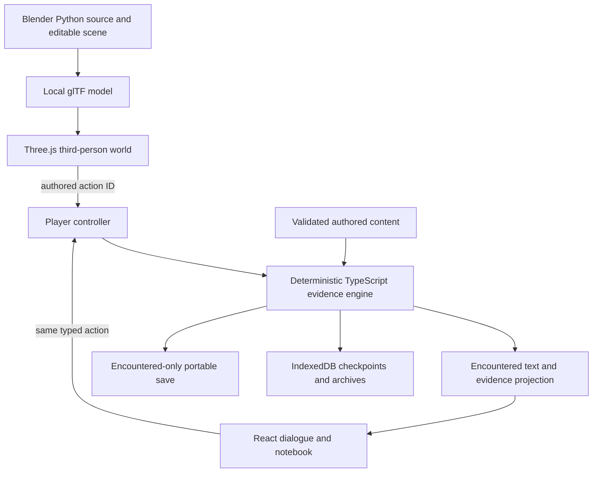

# Current game architecture

A locally runnable browser game built with TypeScript, React and Vite. It now uses a real Three.js world exported from an editable Blender scene. No runtime AI or paid service is needed to play. The current installation is the first movement of the selected living-country rewrite, with the earlier bath prototype retained as a separate edition. The wider game remains in development.

Rendering, camera and walking never decide a fact or secretly change a conversation. The pure engine validates choices, explicit selected evidence, provenance, audiences, character knowledge and immutable encounter history. The occasion extension adds scoped encounters and actor histories while preserving exact earlier saves. The controller coordinates command receipts, async persistence and competing-tab ownership. IndexedDB saves and exported JSON are reconstructed against the exact installed content hash.

The author studio edits the actual schema and previews separately. Author annotations/fixed events stay out of player builds. Vite produces separate player and studio bundles; verified local assets are cached by the service worker for offline play. The Blender source is retained for production but only its compact GLB is shipped. Rejected painted portraits are archived outside public/.

The selected world uses `src/world/rebuild/RebuildWorld.tsx` for rendering, camera and input, `navigation.ts` for bounded local movement, and `profiles.ts` for explicit scene/variant staging and offered action anchors. `tools/blender/build-rebuild.py` produces the editable scene and self-contained GLB. Current text is `src/content/case-v4.json`, compiled by the single lead writer from the saved new manuscript. Known scenes and passage variants are explicitly mapped; unknown staging falls back to the same available text actions without inventing scenery or knowledge.

`src/content/selection.json` selects version 4 and declares version 2 as retained for offline play. `src/content/load-evidence.ts` validates both. `?edition=first-night` opens the earlier bath prototype and exact matching old model. IndexedDB keys separate content hashes, and no automatic old-story migration into the new world exists. Legacy v1-to-v2 migration remains confined to its reviewed original target. Offline readiness verifies every declared asset against its hash for the selected or explicitly retained edition.

The new first movement uses one scoped occasion and a local empty-place return within it. It does not yet implement the projected later long-form returns or the whole country. First-movement completion is identified as a development boundary in the interface. Blender CLI was used; no graphical computer-use operation is claimed.

The first movement’s optional lower-passage staging consumes the already encountered o0.cast-removed source. It does not infer removal from merely inspecting the cast. Future recurrence must distinguish historical records from the current physical occasion before reusing this projection. The final browser wave verifies actual near-E dispatch into the engine, five dialogue/evidence routes, exact replay/reload and offline switching between separately saved editions.
