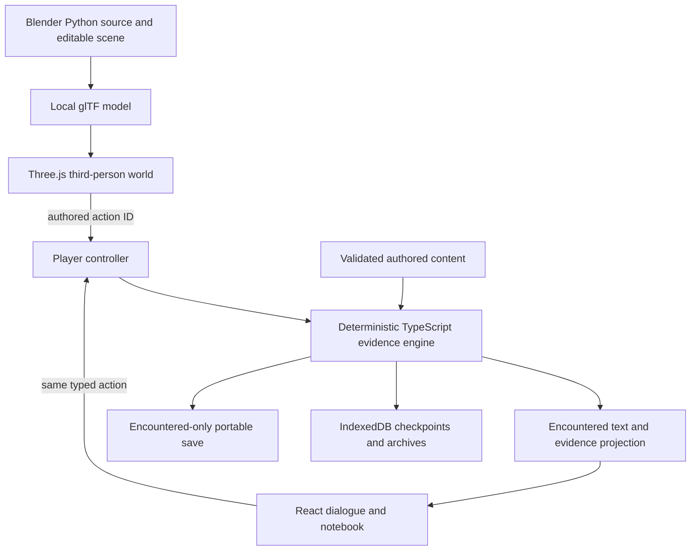

# Current game architecture

A locally runnable browser game built with TypeScript, React and Vite. It now uses a real Three.js world exported from an editable Blender scene. No runtime AI or paid service is needed to play. The current installation covers the short first-night case; expanded recurrence is under integration.

Rendering, camera and walking never decide a fact or secretly change a conversation. The pure engine validates choices, explicit selected evidence, provenance, audiences, character knowledge and immutable encounter history. The occasion extension adds scoped encounters and actor histories while preserving exact earlier saves. The controller coordinates command receipts, async persistence and competing-tab ownership. IndexedDB saves and exported JSON are reconstructed against the exact installed content hash.

The author studio edits the actual schema and previews separately. Author annotations/fixed events stay out of player builds. Vite produces separate player and studio bundles; verified local assets are cached by the service worker for offline play. The Blender source is retained for production but only its compact GLB is shipped. Rejected painted portraits are archived outside public/.

Main world modules: src/world/BathWorld.tsx (renderer/camera/input), navigation.ts (bounded walking and collision), staging.ts (authored scene/interaction positions). Build source: tools/blender/build-bath.py. Current first-night story: src/content/case-v2.json. Root controls eventual installation of a separately reviewed expanded content revision.
