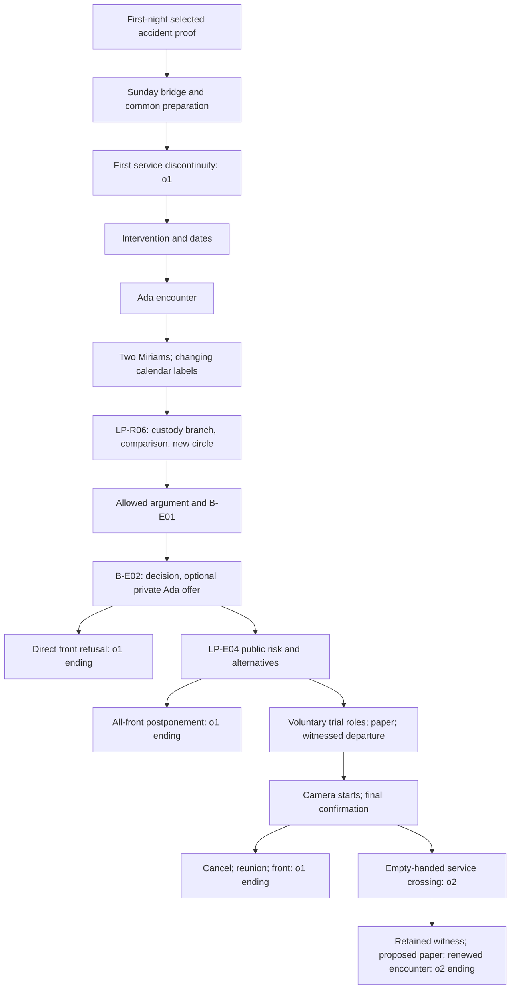

# T-002 occasion, event and knowledge ledger

Input: `69ec3ca3b22238612a5c806c992ed5e212ed2006`. Author-side proposal; lead_writer decides selection. This ledger distinguishes the actual L3 draft from the two replacements in PERFORMED-REVISIONS.md. No recurrence is installed in the live first-night game.

## Terms that do not decide the metaphysics

`o0`, `o1`, `o2` order authored encounters for Blaise. `o0` includes Saturday and Sunday's ordinary progression. They are not world IDs, soul IDs, calendar dates, or claims of universal erasure. A person's *conversation target* can change without the engine asserting numerical identity or nonidentity.

`B` = Blaise; `A`, `S`, `I` = currently encountered interior Ada, Simon and Miriam. `E` = the Miriam observed leaving in B-P01, later encountered outside. At `o2`, `A2/S2/I2` are renewed targets; `E` continues only the actually snapshotted history. Do not expose these technical labels before their encounters or use “real” and “copy” in player UI.

Knowledge types: **O** is a currently encountered observation; **T** is a currently heard attributed testimony; **H** is earlier encountered history remembered by Blaise; **D** is an accepted factual deduction with its exact selected witnesses; **J** is interpretation, hope or judgment. A present report of H is T, not a restored exhibit. Two observations of one physical record can be distinct occurrences while sharing its origin.

## Finite ledger

| Event | Occasion / scene | Event and custody | Who encounters what now | What does not follow |
| --- | --- | --- | --- | --- |
| 00 | Before `o0` arrival | Simon binds cabinet; Miriam requests release; Ada cuts; door hits pier; glass breaks. Original causal sequence stays fixed. | Characters have their respective experiences. B acquires only later sources he actually selects. | B did not witness the accident directly. No return precedes the injury. |
| 01 | `o0`, arrival | B sees the broken mirror, photo/message and twelve-reader count before phone is hidden; hears Simon. | O for B, original anchor-state knowledge for A/S/I. | The screen will not be visible merely because a later scene looks similar. |
| 02 | `o0`, first-night inquiry | Selected film or reconstruction/testimony proof establishes the bounded accident sequence. Public/private disclosure and intimate refusals occur as chosen. | D preserves selected source occurrences; each listener receives only performed disclosures. | No optional private confidence or future-help promise is common setup. |
| 03 | `o0`, next day | Sunday return/open-model work and later chairs by water. B experiences touch and “There you are.” Miriam sees movement from front concourse. | B: O of touch/words. Miriam: observation of movement, not exact words. | A current `o1` Ada will not inherit this later experience. Unwritten Sunday bridge is still an integration dependency. |
| 04 | `o0`, B-P01 | S marks long strip beside burn; distinct shorter bearer is also handled. Miriam carries long strip through front, puts it on sill burned end toward opposite laundry, crosses road. | B observes preparation, placement and departure. Miriam has her own participation. | Short strip is not the unmarked counterpart in B-R06. No continuous watch of exterior wood. |
| 05 | `o0`, service crossing | Covered glass in B's hands, seven keys counted behind him, cardboard catches jamb, strain; next experienced hand is at entrance handle, empty. | B's O of discontinuity; no camera running; no observer sees intervening process. | Parcel's destination, elapsed objective interval and trigger unknown. No “glass caused it” deduction. |
| 06 | `o1`, return anchor | Largest piece against rabbit; broken mirror still bolted; A on bucket, I on bench with peas/wet sock; S hides phone then speaks. | New O tableau/speech. H of photo/read count remains historical. A/S/I have original anchor state. | No current sabotage screen source, no past disclosure permissions. |
| 07 | `o1`, B-R01/R02 | Say Blue or hold handle; action changes response. B describes crossing or asks for prediction test. | Current T to the actual present audience; Blue and silent routes have different text. | Changed memory means changed conditions. Neither route proves uncaused agency. |
| 08 | `o1`, calendar comparison | B, S and interior Miriam show Saturday labels; wall clock lags S by one minute. | Three current screen observations. | Objective reversal or synchronized server log is not inspected. |
| 09 | `o1`, Ada workshop | Ada moves chair; present touch can be requested; remembered contact can be told or fear admitted. Camera is offered, still off. | Ada receives only chosen report. Optional intimate gesture belongs to this encounter. | She is not Sunday's confidant by flag; no recorded return, no accompanied trial. |
| 10 | `o1`, B-R04 knock | E outside; I inside; both answer and move separately, then E enters through front; two chairs/cups/coats persist. | B/A/S/I/E encounter actual co-presence. Camera remains off at E's request. | Rehearsal/twin staging remains a more demanding rival; simple reflection, single change of clothes and sole private hallucination do not account for the public scene as authored. No soul count. |
| 11 | `o1`, optional exterior account | E reports placing wood, waiting under opposite laundry, hearing an unidentified door, returning. | Only listeners of this branch receive T. | She saw neither service crossing nor inside restoration. Hears a door, not a proven service door. |
| 12 | `o1`, B-R05 | B/S/I screens now show Sunday; S shows network time enabled; nobody watched labels change. E places her phone beside I's: same case split, different protector crack. | Current three-screen Sunday O and current physical phone comparison; E's crack account is T. | **No fourth dated screen is stated.** Network correction is possible, not demonstrated cause of all three changes. |
| 13 | `o1`, B-R05 confidences | E's Sunday account follows actual prior visits; mother subject can be mentioned; private contents remain withheld unless chosen. | Distinct listener states. Either woman may ask for private time or a call. | Optional mother's confidence cannot appear from old intimate flag or shared name. Telephone recipient/response remains unperformed. |
| 14 | `o1`, LP-R06 replaces B-R06 | B registers remembered description after prior sight toward sill; Ada retrieves while B watches box, or B/A retrieve while S inspects box. Marked long strip and close unmarked counterpart compared. | Each route has a direct leg and a reported leg; both yield current paired O. E may identify prepared strip with bounded T. | Not wholly blind prediction; not uninterrupted custody; matching display stock not excluded by resemblance alone. |
| 15 | `o1`, LP-R06 | Ada draws new open circle on the unmarked counterpart beside the old marked strip; other strip does not acquire it. | B/A/S directly observe separate manipulability, origin `pair-circle-o1`. E later hears who drew circle if she participates. | No finding that every property or future change is independent; no return trial with this new circle yet. |
| 16 | `o1`, BLAISE-ALLOWED | Paper is description/result, not a blind prediction; interior Miriam argues God/Nature/intellectual love; E absent. | Actual participants receive claims J and heard statements T. | E does not automatically know this conversation. Historical doctrine does not validate a factual proof. |
| 17 | `o1`, B-E01 | E corroborates Sunday chair movement but not exact words; both Miriams argue identity/eternity and attend to dressing. | Separate observation origins for the chair: B's experience and E's viewpoint. Shared pre-anchor accident origins stay shared. | Ordinary recognition remains warranted without a proven simple soul. Eternity does not preserve an autobiography. |
| 18 | `o1`, B-E02 / optional B-E02-B | Proposed empty-handed trial; optional private Ada offer to leave front. Camera placement is not recording or proven boundary. | B/S/A hear only what scene says; private offer is not E's knowledge. | No promise of recovering Sunday's Ada, no exact perimeter, no trial yet. |
| 19 | `o1`, direct refusal | Existing B-E03: camera off, service door closed, both Miriams leave front with group and separate strips. | Current relationships/objects continue in represented departure; no `o2`. | No Monday unlock or final mechanism. Refusal has a full ending after substantial discovery. |
| 20 | `o1`, LP-E04 common | Availability risk stated publicly, including loss of access to a person, not only forgetting. Everyone-outside option actually raised. | B/A/S/I/E have heard this explicit uncertainty. | No guarantee that consent or correct metaphysics makes a crossing safer. |
| 21P | `o1`, all-front postponement | Group chooses front departure; paper with E, both strips with B; sound chair and off camera also taken. | Everyone knows test postponed, no new promise. | **No crossing with everyone outside occurs.** No projected third Miriam. |
| 21T | `o1`, trial setup | I chooses to witness departure; S stays at camera; A stays with I; E agrees to wait outside with paper. S records I's choice, blank future-result line. | Public audience hears choices and Ada's “ask me things / tell me.” E sees page, takes it in inside pocket before witnessed front departure. | I2 cannot inherit I's participation decision. Paper does not certify later safety. |
| 22 | `o1`, recording / final choice | E at bath-side front-left; B returns inside; lower-leg frame agreed; camera starts with A/I behind it. | Current observation of attempted recording, not inspected exit footage. Fresh confirmation before crossing. | E did not hear private Ada offer; filming consent not a loop trigger. |
| 23C | `o1`, cancel | Camera stopped/kept. B tells E outside; she returns wearing coat, with paper. Group departs via B-E03 cancellation variant. | Present setup and cancellation shared; no `o2`. | Recording contains setup only; no crossing footage. |
| 23X | `o2`, second empty-handed crossing | B crosses service threshold empty-handed and experiences same anchor; renewed A2/S2/I2; E still front-left. | B: new O plus H. E recalls only actually heard earlier conversation. | Glass parcel not necessary **for this repeat**; no disproof of its role in the first event. Interior `o1` people, strips, camera and lost duration not located. |
| 24 | `o2`, proposed paper insert | E removes folded sheet; B reads old inscription including crossed-out heading and I's decision; future-result line still blank. | Current inspectable occurrence derived from `o1` inscription. E maintains custody across unseen interval by attributed account. | Not independent corroboration of every recorded assertion. No camera survival. A2/S2/I2 do not read it automatically. |
| 25 | `o2`, B-E05 close | E enters; I2 asks her to wait; B holds entrance; present Ada asks him to close it. | New simultaneous encounter and changed interpersonal circumstance. | `o1` interior Miriam is neither proven dead nor automatically the present speaker; memory/availability loss is consequential even without that verdict. |

## Object custody and observation gaps

| Object | Last established custody before first crossing | `o1` availability | After optional second crossing |
| --- | --- | --- | --- |
| Wrapped glass | B carries it; paper covers reflection. | Anchor broken glass visible, but parcel not located. No current match of each shard or packing paper. | Empty hands observed; no parcel search/result supplied. |
| Long marked strip | E places on exterior sill; nobody continuously guards it. | Retrieved via branch-specific witness/report, compared on workbench. | Source L3 leaves it uninspected. Proposal also leaves both strips on table on trial route; fate unknown. |
| Close counterpart | No exhaustive `o0` box inventory. | S produces/fetches from box; raw resemblance plus separate manipulation observed; new circle added only in proposal. | No inspected restoration or erasure. Never auto-reset this physical claim from an occasion ID. |
| Description/result sheet | Did not exist before first crossing. | Original L3 keeps indoors; proposal publicly adds risks/choice, E pockets for optional trial. | **Proposed** present reinspection with unchanged old text and blank future result. One inscription origin, multiple readings. |
| Spare camera | Offered after first return; off during co-presence. | Frame selected and recording begun only at final setup; kept if cancellation. | Interior attempted recording is historical. No currently retained file observed. |
| Phones / wall clock | Personal possession or fixed wall location; no external time baseline recorded. | Three Saturday labels then three Sunday labels; E case comparison, date unstated; wall has no date. | No automatic carry of calendar conclusion, call result or server record. |
| Coat / confidence | E wears departure coat; corresponding coat remains on hook in renewed room. | Can disambiguate encountered positions but not identity forever. | E still wears coat; I2 at anchor. No private pocket search without performed access. |

## Origins and audience rules

1. `accident-01` is the common originating incident for both Miriams' overlapping earlier testimony. Distinct testimony occurrences are not two independently occurring accidents. The first-night film and witnesses can supply different kinds of support, but a repeat of that film is still the same recording origin.
2. `chair-01` has Blaise's direct touch/words and E's separate visual vantage. E's current testimony independently supports the visible contact, not unheard wording or the current location of that Ada. Two people remembering one event can corroborate distinct perceptions; “same event” alone must not collapse all witness independence.
3. `mark-01` is one witnessed marking. B/E reports overlap there. A newly read paper describing the mark and B's retelling do not add independent marking events. `pair-circle-o1` is a new, deliberately performed event.
4. `sheet-o1` contains attributed observations and judgments. Its `o2` occurrence, if selected, is a current **physical record of earlier assertions**, not current direct evidence of their every referent. To show it to S2 is a new disclosure action, not implicit notebook omniscience.
5. When E is asked about a private offer she did not hear, her answer stays “I wasn't with you.” Her capacity to remember does not grant access. Both callback variants are retained, and no inference that her denial proves the offer did not occur is supported.

## Route graph and ending contracts

This is a finite review graph, not compiled scene JSON. Microchoices in the source (Blue/silence, confidences, gestures, hope, soul claims) alter text, disclosures and relationships; they never determine the transition or factual result. `route-graph.json` enumerates the two material routes and optional private offer as well as the four terminal action paths. The direct refusal and postponement are distinct choices sharing the substantive front ending, not artificially counted as two different complete stories.

**Refusal:** two currently encountered women leave together; the present Ada can answer; shared `o1` history remains available in the represented continuation. The mechanism remains less tested, and Sunday's Ada remains unlocated. A relationship is preserved without certifying sameness. **Repeat:** new evidence narrows a parcel-necessity hypothesis but the current room no longer shares the conversation; one witness and (if selected) one physical account persist. The requested Sunday reunion fails to occur in the represented result. The player trades access to a shared present for a specific, limited test, not for a better philosophical rank. **Cancellation:** setup and its short recording survive; exterior departure is reversed explicitly; the crossing never happens.

## Rival explanations and discriminating interventions

| Rival | What it explains | Pressure from actual evidence | Useful action / honest remaining limit |
| --- | --- | --- | --- |
| Local restoration or re-instantiation within ongoing external duration | Renewed tableau plus exterior continuation, network-corrected labels and retained witness | Strongest economical extraordinary family; predicts neither exact boundary nor mechanism by itself | Test front route, repeated empty-handed crossing and protected exterior record. Current draft supports a bounded descriptive pattern, not a complete generation law. |
| Literal backward traversal of one universal objective time | Earlier-looking room/date and anticipation | Co-present exterior continuation and later Sunday labels need added rules; doesn't uniquely fit findings | Compare independent duration records and exact external observations in a future authored trial; not three networked labels as three independent clocks. |
| Staging, concealed second person, duplicated stock, altered phones | Strongest ordinary adversary across the whole ensemble | Requires real coordinated actors/material arrangements and explains neither B's discontinuity nor histories without extra assumptions; co-presence itself still real | Present paired interventions, separate accounts before prompting, inspect current messages if consented, examine access/custody. No omniscient claim that the whole staging family is logically impossible. |
| B's private memory error or hallucination alone | Anticipated voice, wrong calendar memory, imperfect remembered reply | Insufficient as sole explanation for sustained publicly responding people and inspectable pair as authored | Distinguish first imagined voice from located sound; seek separate reports. Clinical diagnosis not inferred, general skeptical possibility not a veto on all investigation. |
| Parcel/mirror is necessary for return | First event occurs carrying it | Empty-handed repeat defeats necessity of carrying parcel for that repeat | Does not show mirror irrelevant to first event or to local conditions. No retrospectively preventable accident, no mirror-as-noumenal portal. |
| Personal gift, punishment, or immanent Nature | Interpretive accounts of why experience matters | Accident remains earlier than anchor; one event neither proves a benefactor nor refutes every conception of intention | Keep BLAISE-ALLOWED's giving objection alive. Nature needs finite causal explanation, too. No belief flag can provide missing evidence. |

The all-outside service crossing, simultaneous accompanied crossing, continuous exterior filming, matched device-number/call test, inventory of missing parcel, and exact boundary mapping are **not** silently completed by this packet. The all-front ending offers a consequential stop before that unperformed risk. If the lead wants any further experiment in the playable finite case, author its result and propagation first. Do not answer it with a generic reset that manufactures a convenient local contradiction.
