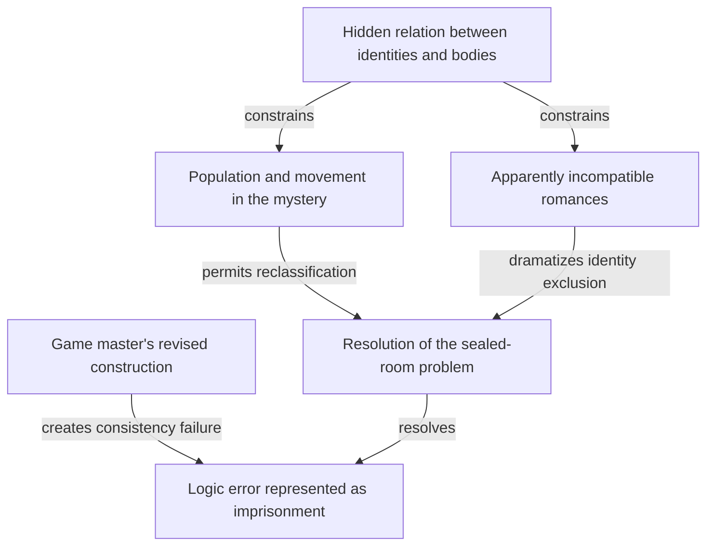

# Metaphysical structures in fiction: findings for the game

**Major spoilers for the reference works.** Completed research synthesis, client date 2026-10-04. The previous coast/eclipse/page proposal remains preserved as an insufficient earlier approach. No new ontology, names or scenes have been installed.

The owner's objection is supported by the comparison. The earlier proposal establishes an unusual relation through three encounters and makes local restoration less complete than Erasmus claimed. That is meaningful, but it does not yet generate a world of comparable depth. Its encounters largely demonstrate the same operation, while the larger history, kinds of being and sources of explanation remain underdeveloped.

The studied works create complexity through different relationships. Some actually alter the ontology of their worlds. Others change who produced an account, what its statements refer to, or which explanation can be trusted. Those achievements can interact, but they are not synonyms. A framed story about branching time does not automatically establish that its enclosing universe branches.

## What was actually researched

Three specialist research assignments and the coordinator's theory study produced four dossiers and 38 source entries. An independent critic read all four and refetched selected high-risk creator claims. The source records distinguish inspected fiction, creator commentary, scholarly interpretation, specialist reconstruction and speculation. The source count is a record of scope, not a quality score.

- **Primary fiction:** complete current author-hosted *Four Revelations of Cinial'jin*; selected *False Sun* passages; selected *Flatland* and *Through the Looking-Glass* chapters; selected event records from the official free English *Hello Charlotte* EP1, downloaded and statically inspected without running the game.
- **Creator evidence:** Gene Wolfe's McCaffery interview; recovered Ryukishi07 interviews; Bakker interviews and publicly author-attributed Q&A; etherane's interview. These establish statements about construction and intended answers, with provenance and translation limits recorded.
- **Interpretive checks:** Borges Center journal studies and reference material; conflicting Wolfe criticism; narrated episode reconstructions and detailed community sources for *Umineko*; Bakker criticism and chronology; narrative-world scholarship.

No new complete reading of the seven Bakker novels, Wolfe's complete novel, the Borges originals, *Umineko* or the full *Hello Charlotte* trilogy is claimed. The detailed *Umineko* EP6 sequence remains secondary reconstruction despite the independently checked creator answer. EP3's *Hello Charlotte* cosmology remains especially dependent on qualified fan interpretation. Those limits travel with the cases below.

## Borges: a discovery changes the discoverer's ontological position

In the critical reconstruction of **The Circular Ruins**, a man painstakingly produces another being through dreams. His work has failures, methods and enabling conditions. He removes the created son's memory of that process, so a causal dependence becomes unavailable to the person who depends on it. News of the son's immunity to fire supplies a diagnostic which threatens that ignorance. When fire later fails to burn the maker, the diagnostic reaches its own user.

The final disclosure does not turn the preceding creation into a false event. It changes the maker's position in the relation he believed he understood. His productive agency and his own created status coexist. The philosopher-critic Almeida's further immanent reading is an interpretation, not a demonstrated enumeration of all reality.

**The Garden of Forking Paths** uses a different architecture. The branching-time account is inside a conversation inside a confession inside a historical frame. The scholar's explanation of an ancestor's apparent failed novel changes its category: book and labyrinth become one achievement. Yet the explaining scholar is also the target of the spy's undisclosed murder plan. His interpretive success cannot protect him from the situation containing his interpretation. Weed's close reading warns against automatically exporting the inset book's ontology into the outer world.

The transferable construction is a relation which later includes or compromises the source that explained it. It is not a borrowed dream ending, labyrinth, multiverse or infinite recursion for its own sake. [Borges/Wolfe dossier, B-RUINS, B-RUINS-PEREZ, B-GARDEN]

## Wolfe: solving identity changes the evidential status of history

**The Fifth Head of Cerberus** connects technological replication, contested indigenous substitution, a supposedly recovered legend and an investigation of the researcher himself. The accounts are not merely repeated perspectives on one scene. They change the authority of one another.

The domestic first account makes generations into a cloning experiment without settling what makes a person persist. The middle account gives precolonial history under anthropologist Marsch's name. The last supplies evidence that a guide assumed Marsch's identity. Wolfe's interview explicitly confirms the guide-to-employer substitution and points to differing competence with firearms as a recoverable clue.

That answer does more than identify an impersonator. It changes who may have produced the apparent historical account and whether the supposed outsider's description is in fact testimony from a colonized subject. It also leaves collective planetary substitution and the substituted person's ethical character contested. Wright's sympathetic reading, Borski's rebuttal and Aramini's rival total reconstruction are not merged into an invented consensus.

The structural lesson is that evidence can survive while the category and authority of its source change. Mundane competence matters as much as extraordinary capacity. This is not necessarily literal causation between narrative levels; it is a transformation of identity, authorship and historical warrant. [Borges/Wolfe dossier, W-MCCAFFERY, W-WRIGHT, W-RESPONSE, W-ARAMINI]

## Umineko: the same identity relation constrains several different plots

In the detailed **EP6 reconstruction**, romance, a sealed-room problem, population counting and a game master's apparent authority converge on the hidden relation between names and bodies. Sayo's identities do not function as freely interchangeable labels for extra physical people. Their incompatible desired futures also give the arrangement psychological force.

Battler's higher position as game master does not grant unrestricted control. Changes involving Erika's seals obstruct his construction, producing a logic error dramatized as imprisonment. The resolution involves the same identity arrangement that makes Shannon and Kanon's romances mutually exclusive. A story about desire and a story about the conditions of a murder are not separately decorated with metaphysical terminology; their constraints meet.

This diagram summarizes explanatory dependencies in the secondary account. It does not declare every arrow a literal transfer of force between worlds. The independently checked Ryukishi07 interview identifies the EP8 manga's Sayo material as his official answer, constraining arbitrary culprit reinterpretations. That statement does not settle every meta-world claim or independently authenticate every EP6 detail.

The transferable achievement is one difficult relation doing psychological, investigative and ontological work. We should not import colored truths, witch courts, the same identity solution or the game-master mechanism. [Games dossier, U1, U3–U5]

## Hello Charlotte: control, memory and explanation have different limits

Direct EP1 event inspection gives a connected sequence stronger than the previous general description. Charlotte resists the Puppeteer's available speech about Felix. Channel switching leads to an altered situation which she remembers differently from him. In the Oracle encounter, the supposedly higher being describes damaged creative powers and a dying universe, then becomes incorporated into Charlotte. A later return brings another explanation: edited memories, coding vocabulary and a guardian who privately admits concealment.

The represented controller, the girl, the world-making being and the withholding guardian therefore have different capacities. Higher status does not establish omnipotence. Knowing another being's memories does not give Charlotte complete knowledge of it. The return changes what can be remembered without removing every consequence.

One implementation fact is particularly concrete: in the inspected Oracle event, Agree and Refuse have empty differentiated branches and converge before the same input-error prompt and continuation. That supports an absent local veto. It does not prove every game choice is ineffective, every route reaches the event, or the truth of the Oracle's cosmology. The code inspection is static, not a playthrough.

The useful structure is the conflict between representation, available control, retained memory and interested explanation. It need not be reduced to a final declaration that the world is a game. No Puppeteer, channel, vessel or source-code mythology is being proposed for Blaise. [Games dossier, H1, especially Maps 039, 148, 129 and 046]

## The Second Apocalypse: effective powers expose one another's blind spots

Bakker's author interviews distinguish forms of sorcery with different enabling conditions. Psûkhe lacks the Mark recognized by competing experts, so a successful detection method can miss a real power. The reconstructed Moënghus episode also makes suppressed passion defeat an attempt to acquire that power. Later author commentary qualifies the supposedly emotionless Logos as itself depending on vestigial emotion.

Theology supplies another interaction. The author says damnation is not made true by a culture's belief, yet access to the Outside is biased and its subject/object boundary unstable. Real consequence does not grant transparent criteria. In *The False Sun*, certainty about eternal suffering transforms what finite cruelties seem worth doing. A character's certainty, the actual existence of damnation and the reliability of the particular vision remain separate claims.

Late-novel reconstruction links divine interventions to a specific blind spot, with creator commentary distinguishing an eternal perspective from successful intervention in time. That structure makes foreknowledge powerful without making it universal. The apparent triumphant return of Kellhus is, by the author's explicit account, a technological deception. Recovering that producer and tactical purpose gives a causal answer while leaving larger theological questions open.

The directly read **Four Revelations** provides the psychological form of another system. Extreme longevity erodes ordinary memory; overwhelming affect retains fragments; the wish to remember an attachment motivates a murder which creates another overwhelming memory. The narrative's temporal interleaving enacts this feedback. It is not a literal demonstration of the Outside's atemporality.

This is a world where independently effective practices collide and reveal dependencies, with people acting on mistaken but useful models. Its structure has histories and consequences beyond the protagonist. We should not copy its apocalypse, divine blind spot, predatory afterlife or atrocity-based immortality. [Bakker dossier, B1–B4, B5 with secondary-reconstruction limits]

## What this demands of a future revision

The coast proposal's deficit is not that its law was false or its experiment useless. It was too isolated. A new structure must explain more than successive manifestations of that relation and the correction of Erasmus's scope. We need to decide which relations actually generate the central mystery, the history of the setting, kinds of person, the powers used by independent characters, and Blaise's desire. Those need not all reduce to one explanation.

The research suggests several distinct possibilities: a creator's criterion turning back on the creator; a solved identity changing who authored the evidence; a shared constraint organizing otherwise different conflicts; a successful power producing selective ignorance; or control and memory diverging across representations. These are findings to develop through a lead's original construction, not a compulsory checklist or five borrowed systems to combine.

The visual ambition remains central. Revelation can change what an earlier space, figure, event or perspective physically is, and what the player can do there. But the structural change must continue to matter after the vista. More scale, nested rooms or black-hole imagery will not alone supply the missing architecture.

Kant and Spinoza should make different, positive demands on that construction. Kant's question concerns the conditions of objective experience and the warrant for claiming an unconditioned ground; an accessible higher realm is not automatically noumenal. Spinoza's positive claim concerns immanent substance, attributes and finite modes, and the ethical transformation through adequate understanding, active affects, intuitive knowledge and intellectual love. Shared consciousness, cosmic belonging and delight do not establish those arguments. A fictional hierarchy of makers may conflict with immanence rather than illustrate it. That conflict should be examined, not harmonized away.

The resulting task is a broader reassessment of the fictional architecture before another scene-led patch. The existing game's central premises are not obligations to which all the research must be fitted. Preserve the playable release and earlier drafts while the research materially changes the next treatment.

## Read further

- [Borges and Wolfe dossier](borges-wolfe/DOSSIER.md), with nine source entries and explicit critical disagreements.
- [Hello Charlotte and Umineko dossier](games/DOSSIER.md), with fourteen source entries, official EP1 map hashes and a reproduced extraction script.
- [Second Apocalypse dossier](bakker/DOSSIER.md), with ten source entries, primary stories and qualified creator/secondary evidence.
- [Narrative-world theory and primary comparators](theory/DOSSIER.md), with five source entries, *Flatland* and *Through the Looking-Glass* passages.
- Independent research critique: `docs/reviews/METAPHYSICAL-STRUCTURES-34/CRITIQUE.md`. Its two precision corrections were applied to the relevant dossiers; reviewed-input hashes and remote spot checks remain preserved.
